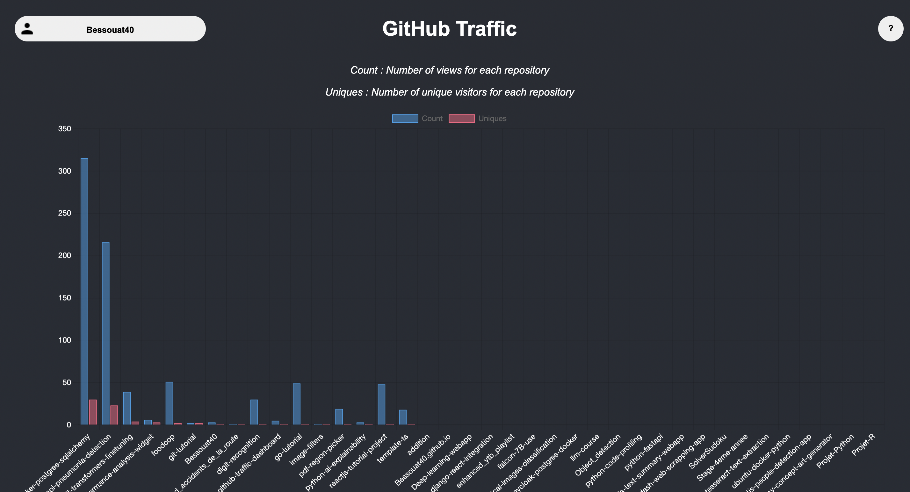

# Github Traffic Dashboard

This project aims to display traffic on your personal projects.

<center>



</center>

## Setup

First you need to create a key for Github API :

- Go to your `Github Page / Settings / Developer settings`

- Click on `Token (classic)`

<center>


</center>

- Click on `Generate new token` / `Generate new token` (not classic)
- Set `Repository access` value to `All repositories`
- For `Permissions`, you need at least to set `Administration` to `Read and write`

Now, you'll have a token value, copy this value to your clipboard and paste this value inside your `.env.example` file :

```bash
TOKEN=... #your token value
```

## Usage

### Setup environment

First you need to setup your environment :

- Fill backend path in `.env.example` file :

```bash
LIBRARY=... #path to ./backend
```

- Change `.env.example` name to `.env` :

```bash
mv .env.example .env
```

### Run application

#### Run backend

```bash
python backend/utils/main.py
```

#### Run frontend

```bash
cd front
npm start
```
